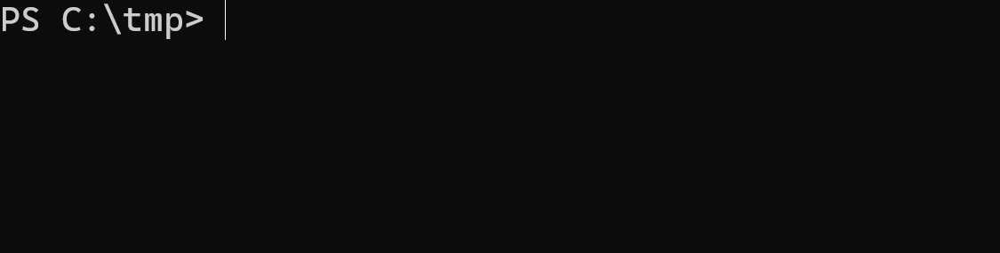

# PowerShell

Every now and then I find myself writing `PowerShell`. It is infrequent enough that I have the time to fully forget the syntax and have to spend hours looking for things I've done over and over again. This guide contains the most common operations I perform in `PowerShell`.

## Contents

- [PowerShell 7](#powershell-7)
- [Always use a Cmdlet](#always-use-a-cmdlet)
  - [Parameters](#parameters)
  - [Verbose](#verbose)
  - [ErrorActionPreference](#erroractionpreference)
  - [Get-Help](#get-help)
- [Break down long lines](#break-down-long-lines)
- [Splatting](#splatting)
- [Arrays](#arrays)
- Commands
  - [Pipe the output of a command into the input of another command](#pipe-the-output-of-a-command-into-the-input-of-another-command)
  - [Discard command output](#discard-command-output)
- [Working with JSON](#working-with-json)
- Objects
  - [Create a custom object](#create-a-custom-object)
  - [Selecting an object property](#selecting-an-object-property)
  - [String interpolation for object properties](#string-interpolation-for-object-properties)
- [Filtering](#filtering)
- [Require a minimum version of PowerShell](#require-a-minimum-version-of-powershell)
- File operations
  - [Read](#read-file)
  - [Write](#write-to-file)
- [Get stderr from external process](#get-stderr-from-external-process)
- [References](#references)

## PowerShell 7

Use [PowerShell 7][powershell-7] as it is a Long Term Support version. Since PowerShell Core 6, PowerShell is cross-platform (`Windows`, `macOS` and `Linux`) and has better defaults (i.e. `Out-File` used to use `UTF-16` with the little-endian byte order and now uses `UTF8` by default).

## Always use a Cmdlet

```powershell
[CmdletBinding()]
param (
    [Parameter(Mandatory=$true)]
    [string]$VpcStackName,

    [Parameter(Mandatory=$true)]
    [int]$NodeCountMax
)

$ErrorActionPreference = 'Stop'
```

In this case the `Cmdlet` is taking `2` parameters (`$VpcStackName` and `$NodeCountMax`). You can also create `Cmdlets` that don't take any parameters. This approach has the following benefits:

- Support for explicit [parameters](#parameters)
- Support [Verbose](#verbose)
- Support for [ErrorActionPreference](#erroractionpreference)
- Support for [Get-Help](#get-help)

### Parameters

Parameters can:

- Be strongly-typed
- Be made mandatory
- Be validated against a set
- Have a default value when optional

Let's create the `deploy.ps1` script with the below content:

```powershell
[CmdletBinding()]
param (
    [Parameter(Mandatory=$true)] # This is a mandatory parameter
    [ValidateSet('DEV', 'UAT', 'PROD')] # The provided parameter has to match a value from the set
    [string]$Environment, # This is a `string` parameter

    [Parameter(Mandatory=$true)]
    [securestring]$AzureSqlServerAdministratorPassword, # This is a `securestring` parameter

    [Parameter()] # This is an optional parameter
    [Int16]$SqlDatabaseBackupRetentionDays = 1 # Optional parameters can have a default value when they're not provided by the user
)
```

The script will throw an error when a parameter does not match the expected set:

```powershell
> ./deploy.ps1 -Environment PreProd
deploy.ps1: Cannot validate argument on parameter 'Environment'. The argument "PreProd" does not belong to the set "DEV,UAT,PROD" specified by the ValidateSet attribute. Supply an argument that is in the set and then try the command again.
```

When you don't provide a value for a `securestring` parameter, `PowerShell` will prompt you for the value and obfuscate the characters as you type them. This has the added benefit that the secret will not be recorded in your shell history.



### Verbose

If I create the following `PowerShell` script named `verbose-demo.ps1`:

```powershell
[CmdletBinding()]
param (
)

Write-Verbose 'Hello from Verbose!'
```

I can execute it in the following fashion:

```bash
> ./verbose-demo.ps1
```

But if I add the the `-Verbose` `Switch`, I'll get a different output:

```bash
> ./verbose-demo.ps1 -Verbose
Hello from Verbose!
```

### ErrorActionPreference

In most of the cases I want my scripts to stop at the first encountered error. Setting `$ErrorActionPreference` to `'Stop'` does exactly this:

```powershell
$ErrorActionPreference = 'Stop'
```

This only impacts the lines below `$ErrorActionPreference = 'Stop'`.

### Get-Help

Create a script name `get-help.ps1`:

```powershell
<#

.SYNOPSIS
A one-liner describing what the script does.

.DESCRIPTION
A longer description. Explain what the script is trying to achieve, call out behaviour that might seem odd at first glance.

.PARAMETER VpcStackName
The name for the CloudFormation stack that deploys the VPC.

.PARAMETER NodeCountMax
The maximum number of nodes (EC2 instances) in your cluster.

.EXAMPLE
./get-help.ps1 -VpcStackName nonprod-eks-vpc

.EXAMPLE
./get-help.ps1 -VpcStackName nonprod-eks-vpc -NodeCountMax 3

You can include more than one example. Helpful to illustrate optional parameters.

.NOTES
Include things such as pre-requisites. This could be the required PowerShell version, PowerShell modules that need to be installed... Also call out any command the user needs to run before calling the script

- PowerShell 7 (https://docs.microsoft.com/en-us/powershell/scripting/install/installing-powershell-core-on-windows?view=powershell-7)
- Azure PowerShell (https://docs.microsoft.com/en-us/powershell/azure/install-az-ps?view=azps-4.2.0)

Before running this script you need to invoke `Connect-AzAccount` to sign-in and you need to select the subscription you want to operate on.

.LINK
A URI where I can get more information. In this case it could be:
https://github.com/gabrielweyer/nuggets/blob/master/README.md

#>

[CmdletBinding()]
param (
    [Parameter(Mandatory=$true)]
    [string]$VpcStackName,

    [Parameter()]
    [int]$NodeCountMax = 8
)
```

```plaintext
> Get-Help ./get-help.ps1

NAME
    C:\tmp\get-help.ps1

SYNOPSIS
    A one-liner describing what the script does.


SYNTAX
    C:\tmp\get-help.ps1 [-VpcStackName] <String> [[-NodeCountMax] <Int32>] [<CommonParameters>]


DESCRIPTION
    A longer description. Explain what the script is trying to achieve, call out behaviour that might seem odd at first glance.


RELATED LINKS
    A URI where I can get more information. In this case it could be:
    https://github.com/gabrielweyer/nuggets/blob/master/README.md

REMARKS
    To see the examples, type: "Get-Help C:\tmp\get-help.ps1 -Examples"
    For more information, type: "Get-Help C:\tmp\get-help.ps1 -Detailed"
    For technical information, type: "Get-Help C:\tmp\get-help.ps1 -Full"
    For online help, type: "Get-Help C:\tmp\get-help.ps1 -Online"

```

## Break down long lines

You can use the backtick character to split a long line over multiple lines:

```powershell
Invoke-Executable aws --region $AwsRegion cloudformation create-stack `
    --stack-name $VpcStackName `
    --role-arn $DeploymentServiceRoleArn `
    --template-body file://eks/eks-vpc.yaml
```

## Splatting

Another way of avoiding having to write very long lines is to use splatting. This is more idiomatic than using backticks.

```powershell
Copy-Item -Path 'test.txt' -Destination 'test2.txt' -WhatIf

# The command above can be rewritten as:

$copyParameters = @{
  Path = 'test.txt'
  Destination = 'test2.txt'
  WhatIf = $true # You need to set the `Switch` parameter to `$true` or `$false`
}

Copy-Item @copyParameters
```

This example is borrowed from [About Splatting][powershell-splatting] in the official `PowerShell` documentation.

## Arrays

### Create an array

```powershell
> @(1, 2, 3)
1
2
3
```

### Add an element to an array

```powershell
$a = @()
$a += 'First element in array'
```

## Commands

### Pipe the output of a command into the input of another command

```powershell
> 'Write me to a file!' | Out-File './output.log'
```

### Discard command output

```powershell
mkdir tmp | Out-Null
```

## Working with JSON

```powershell
> '{"Greeting": "Hello!"}' | ConvertFrom-Json
Greeting
--------
Hello!
```

By default `PowerShell` serialises only `2` levels deep. The below script:

```powershell
$model = @{
    One = @{
        Two = @{
            Three = @{
                Text = 'Hello'
            }
        }
    }
}

Write-Host "`nWithout -Depth parameter:`n"
ConvertTo-Json $model | Write-Host

Write-Host "`nWith -Depth 3 parameter:`n"
ConvertTo-Json $model -Depth 3 | Write-Host
```

Will output:

```plaintext
Without -Depth parameter:

{
  "One": {
    "Two": {
      "Three": "System.Collections.Hashtable"
    }
  }
}

With -Depth 3 parameter:

{
  "One": {
    "Two": {
      "Three": {
        "Text": "Hello"
      }
    }
  }
}
```

## Objects

### Create a custom object

```powershell
[PSCustomObject]@{
    Name = 'Balloon'
    Sum = 15
}
```

### Selecting an object property

```powershell
> '{"Greeting": "Hello!"}' | ConvertFrom-Json | Select-Object -ExpandProperty Greeting
Hello!
```

### String interpolation for object properties

```powershell
Write-Verbose "Created '$($eksAuthConfigurationMapTemporaryFile.FullName)' to store the EKS authentication configuration map"
```

## Filtering

```powershell
$phases = @(
    [PSCustomObject]@{
        Name = 'Lord'
        Sum = 9
    }
    [PSCustomObject]@{
        Name = 'Bucket'
        Sum = 3
    }
    [PSCustomObject]@{
        Name = 'Head'
        Sum = 6
    }
)

$importantPhases = $phases | Where-Object { $_.Sum -gt 5 }
```

## Require a minimum version of PowerShell

At the top of the script:

```powershell
#Requires -Version 7.0
```

[Requires][powershell-requires] also allows to specify modules that should be available on the machine:

```powershell
#Requires -Modules Az
```

## File operations

### Read file

```powershell
$eksAuthConfigurationMapTemplate = Get-Content .\eks\eks-auth-configuration-map.yaml -Raw
```

### Write to file

```powershell
> 'Write me to a file!' | Out-File './output.log'
```

## Get stderr from external process

There is not yet a way to do this across platform, you will have to handle `Windows` and `Unix` differently.

The `Unix` command needs to be surrounded by single quotes.

```powershell
if ($IsWindows) {
    $deleteContextOuput = cmd /c kubectl config delete-context $kubectlContext '2>&1'
} else {
    $shellCommand = "'{ kubectl config delete-context $kubectlContext; } 2>&1'"
    $deleteContextOuput = sh -c $shellCommand
}

if ($LASTEXITCODE -ne 0) {
    Write-Warning "Could not delete context '$kubectlContext', error message was: $deleteContextOuput"
}
```

Based on an answer to the `Stack Overflow` question [PowerShell: Capture the output from external process that writes to stderr in a variable][powershell-capture-stderr].

## References

- [PowerShell documentation][powershell-documentation]
- [PowerShell Explained][powershell-explained]

[powershell-7]: https://docs.microsoft.com/en-us/powershell/scripting/whats-new/what-s-new-in-powershell-70?view=powershell-7
[powershell-capture-stderr]: https://stackoverflow.com/a/45288514/57369
[powershell-splatting]: https://docs.microsoft.com/en-us/powershell/module/microsoft.powershell.core/about/about_splatting?view=powershell-7
[powershell-documentation]: https://docs.microsoft.com/en-us/powershell/scripting/how-to-use-docs?view=powershell-7
[powershell-requires]: https://docs.microsoft.com/en-us/powershell/module/microsoft.powershell.core/about/about_requires?view=powershell-7
[powershell-explained]: https://powershellexplained.com/
