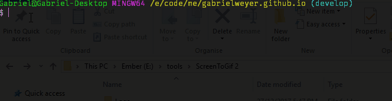

# Getting started with Git on Windows

Install [Git][git].

## Configuration

### Name and email address

```bash
git config --global user.name "Your Name Here"
git config --global user.email your@email.com
```

On a specific repository, navigate to the specific repository:

```bash
git config user.name "Your Name Here"
git config user.email your@email.com
```

### Editor

The editor is used to edit commit messages. I like using `vim`, you don't need to install it as it is included in `Git Bash`.

#### Vim

Vim supports:

- Highlighting the first line of the commit in yellow and shift to grey when more than 50 characters
- You can configure it to wrap:

```bash
git config --global core.editor vim
git config --global format.commitMessageColumns 72
```

#### Notepad

```bash
git config --global core.editor notepad
```

Inside `notepad`: `View` => `Status Bar` (so you can see which column you're on currently).

#### Notepad++

If you absolutely want to you can use `Notepad++` but line wrapping will not work.

```bash
git config --global core.editor "'C:\Program Files (x86)\Notepad++\notepad++.exe' -multiInst -notabbar -nosession -noPlugin"
```

### Difftool and Mergetool

I like using [P4Merge][p4-merge].

#### Difftool

```bash
git config --global diff.tool p4merge
git config --global difftool.p4merge.path 'C:\Program Files\Perforce\p4merge.exe'
```

#### Mergetool

```bash
git config --global merge.tool p4merge
git config --global mergetool.p4merge.path 'C:\Program Files\Perforce\p4merge.exe'
git config --global mergetool.p4merge.trustExitCode false
```

When merging, configure your `mergetool` to not create any backup file:

```bash
git config --global mergetool.keepBackup false
```

## Credentials manager

Install the [Git Credential Manager for Windows][git-credential-manager].

`GCM` supports multi-factor authentication for `Visual Studio Team Services`, `Team Foundation Server`, `GitHub`, and `Bitbucket`.

If you're using multiple accounts on `GitHub`:

```bash
git config --global credential.useHttpPath true
```

This will prompt you for your credentials for each repository.

## Useful aliases

```bash
git config --global alias.st "status"
git config --global alias.lg "log --pretty='%Cred%h%Creset | %s %Cgreen(%cr)%Creset %C(cyan)[%an]%Creset'"
git config --global alias.lg-graph-s "log --graph --abbrev-commit --decorate --format=format:'%C(bold blue)%h%C(reset) - %C(bold green)(%ar)%C(reset) %C(white)%s%C(reset) %C(dim white)- %an%C(reset)%C(auto)%d%C(reset)' --all"
git config --global alias.lg-graph-l "log --graph --abbrev-commit --decorate --format=format:'%C(bold blue)%h%C(reset) - %C(bold cyan)%aD%C(reset) %C(bold green)(%ar)%C(reset)%C(auto)%d%C(reset)%n''          %C(white)%s%C(reset) %C(dim white)- %an%C(reset)' --all"
```

## Handy commands

### Checkout the previous branch

```bash
git checkout -
```



### Find the latest commit that modified a file

```bash
git log -1 -- <file-path>
```

**Note**: this is particularly useful when looking for the commit that deleted a file.

## Config

You can edit your global config with the following command:

```bash
git config --global --edit
```

I recommend adding those settings:

```ini
[core]
    editor = vim -c'startinsert|norm! ggA' - vim will start in INSERT mode
[push]
    default = simple
    followTags = true - Instead of manually pushing new tags with --follow-tags, you always send your annotated tags up along with a git push.
[status]
    showUntrackedFiles = all - shows you all the files underneath that new directory during a git status
```

## Main Git branching models

- [Gitflow][gitflow]
- [GitHub Flow][github-flow]
- [Trunk based development][trunk-based-development]

## References

- [How to Write a Git Commit Message][commit-message]
- [Flight rules for git][flight-rules]

### Talks

- :moneybag: [Git Fundamentals][git-fundamentals] (Pluralsight)
- :moneybag: [How Git Works][how-git-works] (Pluralsight)
- :moneybag: [Advanced Git Tips and Tricks][advanced-git-tips-and-tricks] (Pluralsight)
- [The Things Git Can Do (that none of the GUIs have ever told you about)][the-things-git-can-do]

### Books

- [Pro Git, Second Edition][pro-git]

[git]: https://git-scm.com/downloads
[git-credential-manager]: https://github.com/Microsoft/Git-Credential-Manager-for-Windows
[p4-merge]: https://www.perforce.com/products/helix-core-apps/merge-diff-tool-p4merge
[gitflow]: http://nvie.com/posts/a-successful-git-branching-model/
[trunk-based-development]: https://trunkbaseddevelopment.com/
[github-flow]: https://guides.github.com/introduction/flow/
[flight-rules]: https://github.com/k88hudson/git-flight-rules
[commit-message]: https://chris.beams.io/posts/git-commit/
[git-fundamentals]: https://www.pluralsight.com/courses/git-fundamentals
[how-git-works]: https://www.pluralsight.com/courses/how-git-works
[advanced-git-tips-and-tricks]: https://www.pluralsight.com/courses/git-advanced-tips-tricks
[the-things-git-can-do]: https://vimeo.com/171317261
[pro-git]: https://git-scm.com/book/en/v2
