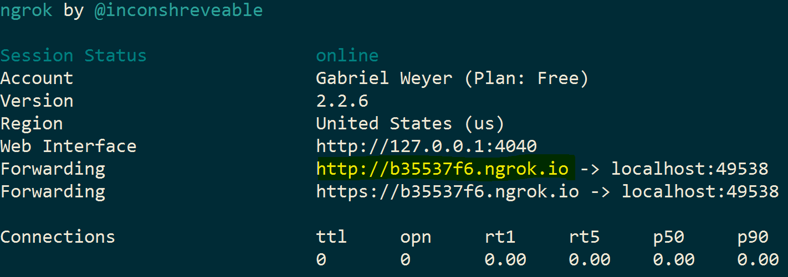

# ngrok

Expose a local server behind a NAT or firewall to the internet.

Particularly useful if you're serving an `API` over `HTTPS` being consumed by a mobile application. `HTTP` requests going through `ngrok` can be inspected on a locally hosted web console.

## Stack

- `ngrok 2.2.6`
- `Visual Studio 2017`
- `IIS Express 10.0.14358.1000`
- `Windows 10`

## How to

- Extract [ngrok][ngrok] (no installation is required)
- Write down the `HTTP` port (not the `HTTPS` one) of the web project setting in `Visual Studio`
- Edit `.vs\config\applicationhost.config`
  - Look for `bindingInformation` for your web app (can be identified by the path)
  - Create a new entry with `localhost` replaced by nothing

```xml
<binding protocol="http" bindingInformation=":49538:" /> <!-- This is the added line -->
<binding protocol="http" bindingInformation="*:49538:localhost" />
<binding protocol="https" bindingInformation="*:44315:localhost" />
```

- Launch `Visual Studio` as an Administrator (you'll need to be elevated to bind to a non `localhost` `HOST`)
- `ngrok http http-local-port` (`49538` in this example)
  - `ngrok` will display the `ngrok` `URL` used to access your `localhost`:



[ngrok]: https://ngrok.com/