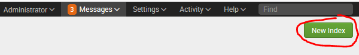
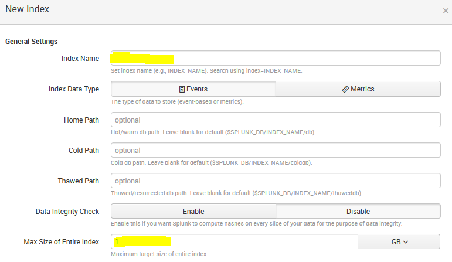
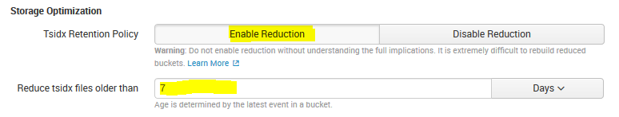
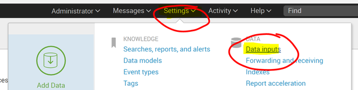
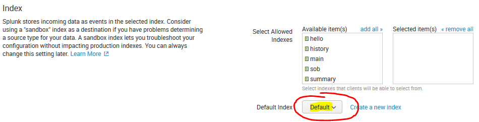
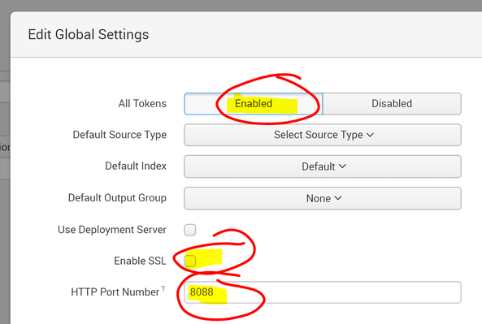

# Splunk

This guide will help you to run `Splunk` locally and configure a `HTTP Event Collector`.

## Prerequisites

- [Docker][docker-community-edition]

## Docker Compose

Create a file named `docker-compose.yml`:

```yaml
version: '3'

volumes:
  opt-splunk-etc:
  opt-splunk-var:

services:
  splunk:
    hostname: localhost
    image: splunk/splunk:7.0.2
    environment:
      SPLUNK_START_ARGS: --accept-license --answer-yes
    volumes:
      - opt-splunk-etc:/splunk/etc
      - opt-splunk-var:/splunk/var
    ports:
      - "8000:8000"
      - "8088:8088"
```

**Note**: I only care about opening the ports for the portal (`8000`) and the `HTTP Event Collector` (`8088`). Your requirements may vary.

Then in the directory where you created this file:

```posh
docker-compose up
```

## Configure Splunk

### Create an `index`

I recommend creating an `index` as it is the easiest way to discard events when you don't need them anymore.








### `Data inputs`



### Add a `HTTP Event Collector`


### Configure the `HTTP Event Collector`

Name your `Collector`:


On the second page, select the default `index`:



### Enable the token

By default `Collectors` are disabled.


- Enable `All Tokens`
- Uncheck `Enable SSL`
- Set the `HTTP Port Number` - you should set this to `8088` or whatever value you used in `docker-compose.yml`



[docker-community-edition]: https://www.docker.com/community-edition#/download
