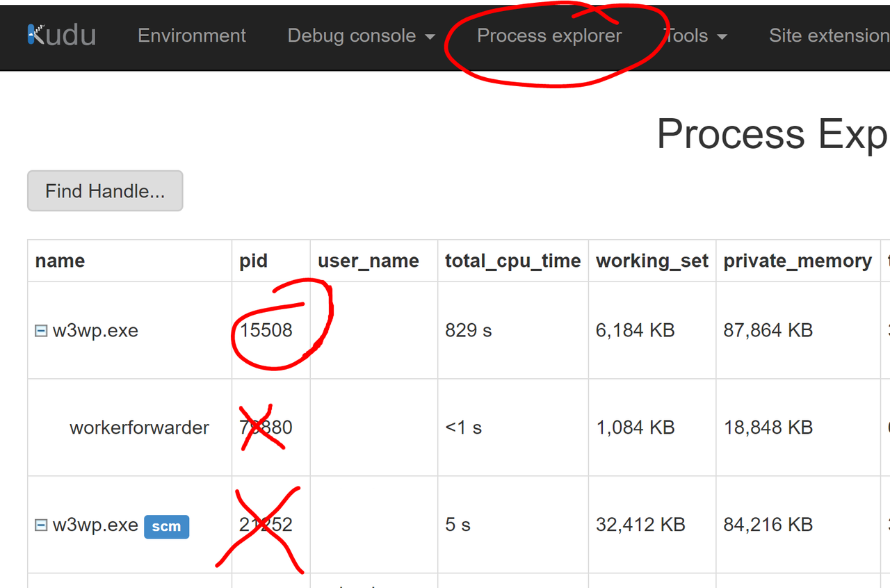
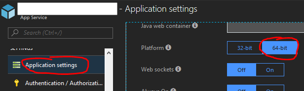

# Write a memory dump in an Azure App Service

When a web app becomes unresponsive and you can't find any evidence by reviewing the logs, event viewer etc. it is critical to write a memory bump before restarting the application. It only takes a few minutes and can be downloaded and analysed at a later stage.

## Launch the Kudu console

In the [Azure portal][azure-portal] select the faulty web app.

- Go to the `Kudu` console:


You can also access the `Kudu` console directly by appending `.scm` after the name of the web app:

- i.e. if your web app is accessible at [https://dummy.azurewebsites.net/](https://dummy.azurewebsites.net/)
- You can then access the `Kudu` console at [https://dummy.scm.azurewebsites.net/](https://dummy.scm.azurewebsites.net/)

:clipboard: if you have multiple instances and only one of them is faulty, you'll have to make sure you are on the correct instance.

## Find the process Id of w3wp

### ASP.NET Core


### ASP.NET



## Write the memory dump

:rotating_light: Writing a memory dump will **halt** `IIS` for some time (depending on how much memory the process is consuming). Sadly you can't clone the process, see [The handle is invalid](#the-handle-is-invalid) as to why.

You can leverage [ProcDump][procdump] which is pre-installed.

Open the `PowerShell` `Debug console`:


Type the following commands one by one:

```posh
mkdir D:\home\LogFiles\dumps
```

```posh
D:\devtools\sysinternals\procdump64.exe -accepteula -ma <pid> D:\home\LogFiles\dumps\
```

`<pid>` should be the process Id you wrote down earlier.

## Troubleshooting

### The handle is invalid

```text
[02:23:34] Dump 1 error: Error writing dump file: 0x80070006

The handle is invalid. (0x80070006, -2147024890)
```

This is most likely because you've tried to use the arguments `-r` and `-a`. The `Windows` user running the `PowerShell` session does not have the permission to call `PssCaptureSnapshot`.

### ASP.NET Core is always 32-bit

Azure ignores the `Platform` setting for `ASP.NET Core`.



Even if you set the `Platform` to `64-bit` the app will still run as `32-bit`. There are workarounds documented [here][64-bit-core].

[azure-portal]: https://portal.azure.com/
[procdump]: https://docs.microsoft.com/en-us/sysinternals/downloads/procdump
[64-bit-core]: https://blogs.msdn.microsoft.com/webdev/2018/01/09/64-bit-asp-net-core-on-azure-app-service/
